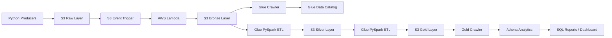
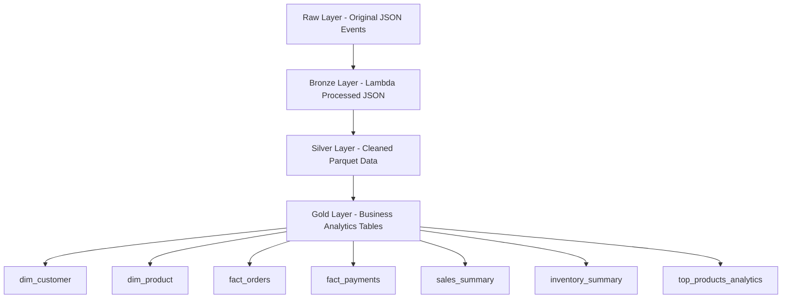
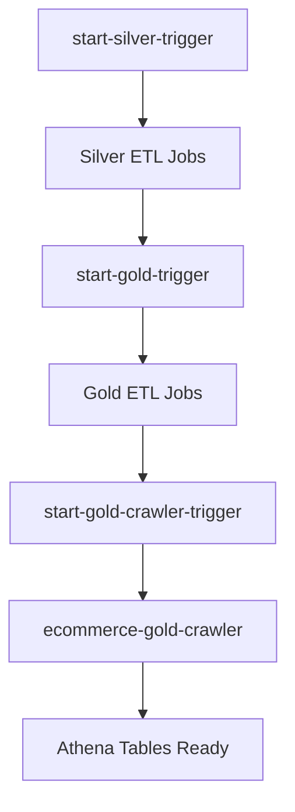
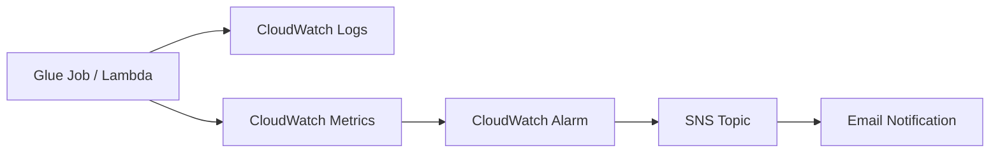

# AWS Real-Time Ecommerce Data Engineering Pipeline

## Project Overview

This project is a real-time AWS-based ecommerce data engineering platform built using Medallion Architecture (Raw → Bronze → Silver → Gold).

The pipeline simulates streaming ecommerce events such as:

* Orders
* Payments
* Inventory updates
* Delivery events
* Cart activities
* Customer activities

The project processes real-time streaming events into analytical datasets using AWS serverless services and PySpark ETL pipelines.

---

# Architecture

## High-Level Architecture



---

# Medallion Architecture



---

# AWS Services Used

| Service           | Purpose                 |
| ----------------- | ----------------------- |
| Amazon S3         | Data lake storage       |
| AWS Lambda        | Event-driven processing |
| AWS Glue          | ETL processing          |
| AWS Glue Crawlers | Metadata discovery      |
| AWS Athena        | SQL analytics           |
| CloudWatch        | Monitoring              |
| SNS               | Email alerts            |
| IAM               | Access control          |

---

# Features

* Real-time streaming event simulation
* S3 data lake architecture
* Medallion architecture implementation
* Lambda-based event processing
* Glue PySpark ETL pipelines
* Athena SQL analytics
* Glue Workflow orchestration
* CloudWatch monitoring
* SNS email alerts
* Gold analytical datasets

---

# Project Structure

```text
aws-realtime-ecommerce-data-engineering/
├── producers/
├── lambda_functions/
├── glue_jobs/
├── glue_crawlers/
├── sql/
├── monitoring/
├── docs/
├── dashboard/
├── orchestration/
└── scripts/
```

---

# Pipeline Flow

## Step 1 — Real-Time Producers

Python producers generate ecommerce streaming events.

## Step 2 — Raw Layer

Events are uploaded into S3 raw layer.

## Step 3 — Lambda Processing

S3 event notifications trigger Lambda processing.

## Step 4 — Bronze Layer

Lambda stores validated JSON events into Bronze layer.

## Step 5 — Silver Layer

Glue PySpark ETL jobs:

* clean data
* remove duplicates
* standardize schema
* convert JSON to parquet

## Step 6 — Gold Layer

Business analytical datasets are created:

* dimension tables
* fact tables
* KPI datasets

## Step 7 — Athena Analytics

Athena queries analytical datasets using SQL.

---

# Glue Workflow Automation



---

# Monitoring Architecture



---

# Athena SQL Analytics

The project includes analytical queries for:

* Revenue analysis
* Failed payment analysis
* Customer behavior analysis
* Inventory analysis
* Top product analysis
* Delivery analysis
* KPI dashboards

---

# Example Athena Queries

## Top Products

```sql
SELECT
    product_name,
    category,
    total_revenue
FROM top_products_analytics
ORDER BY total_revenue DESC
LIMIT 10;
```

## Failed Payments

```sql
SELECT
    payment_method,
    COUNT(*) AS failed_payments
FROM fact_payments
WHERE payment_status = 'FAILED'
GROUP BY payment_method;
```

---

# Monitoring

CloudWatch alarms monitor:

* Glue job failures
* Lambda errors
* Pipeline execution failures

SNS notifications send email alerts.

---

# Screenshots

## S3 Medallion Layers

* Raw Layer
* Bronze Layer
* Silver Layer
* Gold Layer

## Glue Workflow

* Automated orchestration pipeline

## Athena Analytics

* SQL query results

## Monitoring

* CloudWatch alarms
* SNS notifications

---

# Future Enhancements

* Terraform infrastructure automation
* Airflow orchestration
* Step Functions orchestration
* Data quality framework
* Incremental ETL processing
* Redshift integration
* QuickSight dashboards

---

# Resume Description

Built a real-time AWS data engineering pipeline using S3, Lambda, Glue, Athena, PySpark, CloudWatch, and Medallion Architecture for processing streaming ecommerce events into Bronze, Silver, and Gold analytical layers with workflow orchestration and monitoring.

---

# docs/aws_services_used.md

# AWS Services Used

## Amazon S3

Used as the centralized data lake storage layer.

## AWS Lambda

Used for event-driven file processing.

## AWS Glue

Used for PySpark ETL transformations.

## AWS Glue Crawlers

Used to scan S3 datasets and create Athena metadata tables.

## Amazon Athena

Used for serverless SQL analytics.

## Amazon CloudWatch

Used for monitoring Glue jobs and Lambda logs.

## Amazon SNS

Used for sending failure notification emails.

## AWS IAM

Used for access control and permissions.

---

# docs/data_flow.md

# Data Flow

1. Producers generate ecommerce events.
2. Events are uploaded into S3 raw layer.
3. S3 triggers Lambda.
4. Lambda processes and stores files into Bronze layer.
5. Glue ETL converts Bronze to Silver.
6. Gold ETL creates analytical datasets.
7. Glue crawler scans Gold layer.
8. Athena queries Gold datasets.

---

# docs/project_setup_steps.md

# Project Setup Steps

1. Create AWS account.
2. Configure IAM permissions.
3. Create S3 bucket.
4. Configure AWS CLI.
5. Create Python virtual environment.
6. Install requirements.
7. Run producers.
8. Configure Lambda trigger.
9. Create Glue ETL jobs.
10. Create Glue crawlers.
11. Create Athena databases.
12. Configure CloudWatch monitoring.
13. Configure Glue workflow.

---

# docs/deployment_steps.md

# Deployment Steps

1. Upload Glue ETL scripts.
2. Configure IAM roles.
3. Configure S3 event notifications.
4. Create Lambda function.
5. Create Glue jobs.
6. Create Glue crawlers.
7. Create Athena databases.
8. Configure monitoring.
9. Execute Glue workflow.

---

# docs/interview_questions.md

# Interview Questions

## What is Medallion Architecture?

Medallion architecture organizes data into Raw, Bronze, Silver, and Gold layers for scalable data engineering pipelines.

## Why use Parquet?

Parquet provides columnar storage, compression, and faster analytics queries.

## Why use Athena?

Athena enables serverless SQL querying directly on S3.

## Why use Glue?

Glue provides serverless Spark-based ETL processing.

## Why use Lambda?

Lambda supports event-driven serverless processing.

## What is the difference between Bronze, Silver, and Gold?

* Bronze: raw validated data
* Silver: cleaned and transformed data
* Gold: business analytics datasets

---

# docs/troubleshooting.md

# Troubleshooting

## AccessDenied Error

Verify IAM permissions for S3, Glue, and Lambda.

## Athena Query Failure

Verify Glue crawler completed successfully.

## Glue Job Failure

Check CloudWatch logs.

## Lambda Trigger Not Working

Verify S3 event notifications are configured.

## No Data in Silver Layer

Verify Glue ETL jobs completed successfully.

---

# docs/screenshots.md

# Screenshots Checklist

## S3

* raw layer
* bronze layer
* silver layer
* gold layer

## Lambda

* function overview
* S3 trigger
* logs

## Glue Jobs

* silver ETL jobs
* gold ETL jobs

## Glue Workflow

* workflow DAG

## Athena

* analytics queries
* query results

## Monitoring

* CloudWatch alarm
* SNS notification

## Architecture

* medallion architecture
* workflow architecture
