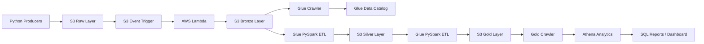
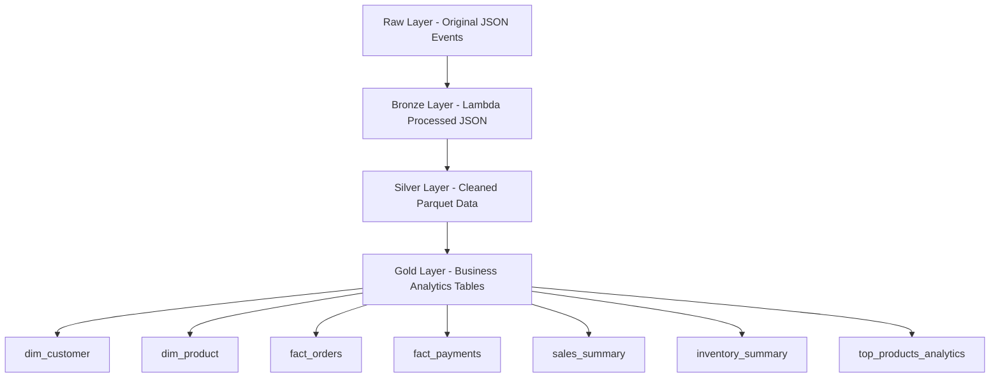
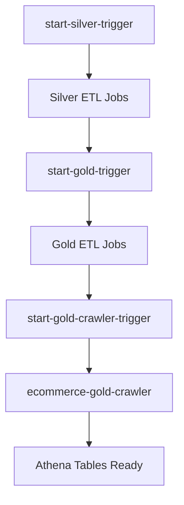
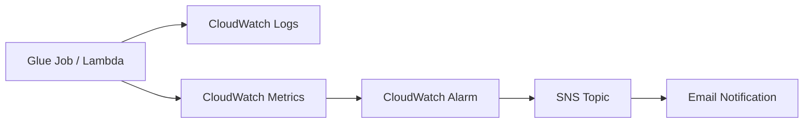

# AWS Real-Time Ecommerce Data Engineering Architecture

## High-Level Architecture

```mermaid
flowchart LR
    A[Python Producers] --> B[S3 Raw Layer]
    B --> C[S3 Event Trigger]
    C --> D[AWS Lambda]
    D --> E[S3 Bronze Layer]
    E --> F[Glue Crawler]
    F --> G[Glue Data Catalog]
    E --> H[Glue PySpark ETL]
    H --> I[S3 Silver Layer]
    I --> J[Glue PySpark ETL]
    J --> K[S3 Gold Layer]
    K --> L[Gold Crawler]
    L --> M[Athena Analytics]
    M --> N[SQL Reports / Dashboard]
```

---

# Medallion Architecture

```mermaid
flowchart TD
    A[Raw Layer - Original JSON Events] --> B[Bronze Layer - Lambda Processed JSON]
    B --> C[Silver Layer - Cleaned Parquet Data]
    C --> D[Gold Layer - Business Analytics Tables]

    D --> E[dim_customer]
    D --> F[dim_product]
    D --> G[fact_orders]
    D --> H[fact_payments]
    D --> I[sales_summary]
    D --> J[inventory_summary]
    D --> K[top_products_analytics]
```

---

# Workflow Orchestration

```mermaid
flowchart TD
    A[start-silver-trigger] --> B[Silver ETL Jobs]
    B --> C[start-gold-trigger]
    C --> D[Gold ETL Jobs]
    D --> E[start-gold-crawler-trigger]
    E --> F[ecommerce-gold-crawler]
    F --> G[Athena Tables Ready]
```

---

# Monitoring Architecture

```mermaid
flowchart LR
    A[Glue Job / Lambda] --> B[CloudWatch Logs]
    A --> C[CloudWatch Metrics]
    C --> D[CloudWatch Alarm]
    D --> E[SNS Topic]
    E --> F[Email Notification]
```
